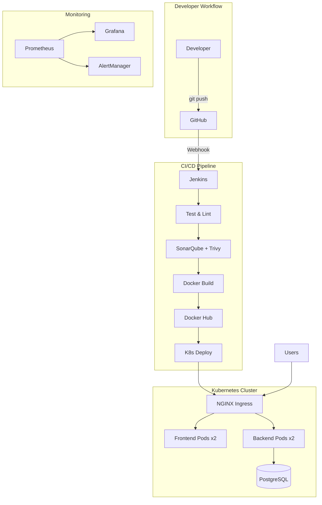

<p align="center">
  <h1 align="center">🤖💰 AI Expense Tracker</h1>
  <p align="center">
    <strong>Production-Grade DevOps + DevSecOps Pipeline</strong>
  </p>
  <p align="center">
    A full-stack expense tracking application with AI-powered categorization, wrapped in an industry-level DevOps infrastructure featuring CI/CD, Kubernetes, monitoring, and security scanning.
  </p>
</p>

<p align="center">
  <a href="#"></a>
  <a href="#"></a>
  <a href="#"></a>
  <a href="#"></a>
  <a href="#"></a>
  <a href="#"></a>
  <a href="#"></a>
  <a href="#"></a>
  <a href="#"></a>
  <a href="#"></a>
  <a href="#"></a>
  <a href="#"></a>
</p>

<p align="center">
  <a href="#"></a>
  <a href="#"></a>
  <a href="#"></a>
  <a href="#"></a>
</p>

---

## 📋 Table of Contents

- [Overview](#-overview)
- [Architecture](#-architecture)
- [Tech Stack](#-tech-stack)
- [Features](#-features)
- [Quick Start](#-quick-start)
- [Project Structure](#-project-structure)
- [CI/CD Pipeline](#-cicd-pipeline)
- [Kubernetes Deployment](#-kubernetes-deployment)
- [Monitoring & Observability](#-monitoring--observability)
- [Infrastructure as Code](#-infrastructure-as-code)
- [DevSecOps](#-devsecops)
- [API Documentation](#-api-documentation)
- [Screenshots](#-screenshots)
- [Future Enhancements](#-future-enhancements)
- [Contributing](#-contributing)
- [License](#-license)

---

## 🎯 Overview

The **AI Expense Tracker** is not just another CRUD app — it's a complete, production-grade DevOps showcase project demonstrating **10+ industry tools** working together in a real-world scenario.

### What it does:
- 📊 Track personal/business expenses with CRUD operations
- 🤖 **AI-powered auto-categorization** using keyword matching
- 📈 Spending analytics with interactive charts
- 🔄 Full CI/CD pipeline from code push to production deployment
- 📡 Real-time monitoring with dashboards and alerting

### DevOps Concepts Demonstrated:
| Concept | Tools |
|---------|-------|
| Containerization | Docker, Docker Compose |
| Orchestration | Kubernetes (Deployments, Services, HPA, Ingress) |
| CI/CD | Jenkins, GitHub Actions |
| Infrastructure as Code | Terraform (AWS VPC, EC2, IAM) |
| Configuration Management | Ansible (server provisioning) |
| Monitoring & Observability | Prometheus, Grafana, AlertManager |
| DevSecOps | SonarQube, Trivy, OWASP Dependency Check |
| Reverse Proxy & Load Balancing | NGINX |
| Cloud Deployment | AWS EC2, Security Groups |

---

## 🏗 Architecture



> See [docs/ARCHITECTURE.md](docs/ARCHITECTURE.md) for detailed architecture documentation.

---

## 🛠 Tech Stack

| Layer | Technology | Version |
|-------|-----------|---------|
| **Frontend** | React | 18.x |
| **Backend** | FastAPI (Python) | 0.115.x |
| **Database** | PostgreSQL | 16 |
| **Containerization** | Docker | 24.x |
| **Orchestration** | Kubernetes | 1.30 |
| **CI/CD** | Jenkins + GitHub Actions | LTS |
| **IaC** | Terraform | 1.5+ |
| **Config Management** | Ansible | 2.15+ |
| **Monitoring** | Prometheus + Grafana | Latest |
| **Security** | SonarQube + Trivy + OWASP | Latest |
| **Reverse Proxy** | NGINX | 1.27 |
| **Cloud** | AWS (EC2, VPC, IAM) | - |
| **Registry** | Docker Hub | - |

---

## ✨ Features

### Application Features
- ✅ Full CRUD for expenses (Create, Read, Update, Delete)
- ✅ AI-powered expense categorization (14 categories)
- ✅ Spending analytics with category breakdown
- ✅ Interactive dashboards with Chart.js
- ✅ Pagination, filtering, sorting
- ✅ Responsive dark-mode UI with glassmorphism design
- ✅ RESTful API with Swagger documentation

### DevOps Features
- ✅ Multi-stage Docker builds (optimized images)
- ✅ Docker Compose (dev + production)
- ✅ 11-stage Jenkins CI/CD pipeline
- ✅ GitHub Actions backup CI
- ✅ Kubernetes manifests (Deployment, Service, Ingress, HPA, PV/PVC)
- ✅ Terraform AWS infrastructure (VPC, EC2, SG, IAM)
- ✅ Ansible server configuration (Docker, K8s, Jenkins, Monitoring)
- ✅ Prometheus metrics collection
- ✅ Grafana dashboards with alerting
- ✅ NGINX reverse proxy with rate limiting
- ✅ SonarQube + Trivy + OWASP security scanning
- ✅ Rolling updates & auto-scaling (HPA)
- ✅ Database backup scripts
- ✅ Health check endpoints (K8s probes)

---

## 🚀 Quick Start

### Prerequisites
- [Docker](https://docs.docker.com/get-docker/) & Docker Compose
- [Git](https://git-scm.com/)

### One-Command Setup
```bash
# Clone the repository
git clone https://github.com/adeshbusari20/AI-Expense-Tracker-DevOps.git
cd AI-Expense-Tracker-DevOps

# Create environment file
cp .env.example .env

# Start everything
docker compose up -d

# Verify
curl http://localhost:8000/health
```

### Access
| Service | URL |
|---------|-----|
| Frontend | http://localhost:3000 |
| Backend API | http://localhost:8000 |
| API Docs (Swagger) | http://localhost:8000/docs |
| NGINX Proxy | http://localhost |
| Prometheus | http://localhost:9090 |
| Grafana | http://localhost:3001 |

---

## 📁 Project Structure

```
AI-Expense-Tracker-DevOps/
├── frontend/                       # React application
├── backend/                        # FastAPI application
├── kubernetes/                     # K8s manifests (10 files)
├── terraform/                      # AWS IaC (11 files)
│   ├── ec2.tf                      # Multi-server EC2 config
│   ├── ec2-single.tf               # Single-server (Option A)
│   ├── vpc.tf                      # VPC + networking
│   ├── security-groups.tf          # Firewall rules
│   ├── iam.tf                      # IAM roles & policies
│   └── terraform.tfvars.single     # Single-instance variables
├── ansible/                        # Server automation (7 playbooks + 3 roles)
│   └── playbooks/
│       ├── deploy-production.yml   # Full production deploy
│       ├── setup-ssl.yml           # Let's Encrypt SSL
│       └── ...                     # Docker, Jenkins, K8s, Monitoring
├── monitoring/                     # Prometheus + Grafana + AlertManager
├── jenkins/                        # Custom Jenkins Docker image
├── nginx/                          # Reverse proxy configuration
│   └── conf.d/
│       ├── default.conf            # HTTP config
│       └── production.conf         # HTTPS production config
├── scripts/                        # Utility scripts
│   ├── deploy-production.sh        # One-command production deploy
│   ├── provision-aws.sh            # AWS infrastructure provisioning
│   ├── setup-ssl.sh                # Let's Encrypt SSL automation
│   ├── deploy.sh                   # K8s deployment
│   ├── setup.sh                    # Local dev setup
│   ├── health-check.sh             # Service health checks
│   └── backup-db.sh                # Database backup
├── docs/                           # Documentation (7 guides)
│   ├── PRODUCTION_DEPLOYMENT.md    # Complete cloud deployment guide
│   └── ...                         # API, Architecture, Security, etc.
├── .github/workflows/              # GitHub Actions CI
├── docker-compose.yml              # Development environment
├── docker-compose.prod.yml         # Production environment
├── docker-compose.prod.single.yml  # All-in-one (app + monitoring)
├── .env.production.example         # Production env template
├── Jenkinsfile                     # 11-stage CI/CD pipeline
├── Makefile                        # Convenience commands
└── README.md
```

---

## 🔄 CI/CD Pipeline

### Jenkins Pipeline (11 Stages)

```
Git Push → Checkout → Install Deps → Lint → Unit Tests → SonarQube
→ Security Scan (Trivy + OWASP) → Docker Build → Push to Docker Hub
→ Deploy to K8s → Health Check
```

### Pipeline Features
- ⚡ Parallel execution (frontend + backend simultaneously)
- 🔒 Security scanning as a gate
- 🐳 Multi-image Docker build & push
- ☸️ Automated Kubernetes deployment
- 🔄 Rollback on failure
- 📊 Test results published to Jenkins

### GitHub Webhook Setup
1. Go to GitHub repo → Settings → Webhooks
2. Payload URL: `http://<jenkins-ip>:8080/github-webhook/`
3. Content type: `application/json`
4. Events: Just the push event

---

## ☸️ Kubernetes Deployment

### Resources Created
| Resource | File | Purpose |
|----------|------|---------|
| Namespace | `namespace.yaml` | Resource isolation |
| ConfigMap | `configmap.yaml` | Non-sensitive config |
| Secret | `secrets.yaml` | DB credentials |
| Deployment (Frontend) | `frontend-deployment.yaml` | React pods (2 replicas) |
| Deployment (Backend) | `backend-deployment.yaml` | FastAPI pods (2 replicas) |
| StatefulSet (DB) | `postgres-statefulset.yaml` | PostgreSQL with PV |
| Ingress | `ingress.yaml` | NGINX routing |
| HPA | `hpa.yaml` | Auto-scaling (2-10 pods) |
| PV/PVC | `pv.yaml`, `pvc.yaml` | 10Gi persistent storage |

### Deploy to K8s
```bash
make k8s-deploy
# or
kubectl apply -f kubernetes/
```

---

## 📡 Monitoring & Observability

### Stack
- **Prometheus** — Metrics collection (scrapes `/metrics` every 15s)
- **Grafana** — Dashboards & visualization
- **AlertManager** — Alert routing (Email/Slack)
- **Node Exporter** — System metrics
- **cAdvisor** — Container metrics

### Start Monitoring
```bash
make monitoring-up
# Access Grafana at http://localhost:3001 (admin/admin)
```

### Alerts Configured
- 🔴 High Error Rate (>5% for 5min)
- 🟡 Slow Response Time (p95 > 2s)
- 🔴 Service Down (1min)
- 🟡 High CPU (>80% for 10min)
- 🟡 High Memory (>85% for 5min)
- 🔴 Disk Space Low (>85%)

> See [docs/MONITORING.md](docs/MONITORING.md) for full guide.

---

## 🏗 Infrastructure as Code

### Terraform (AWS)
```bash
cd terraform
terraform init
terraform plan
terraform apply
```

**Resources provisioned:**
- VPC with public/private subnets (2 AZs)
- 3 EC2 instances (App, Jenkins, Monitoring)
- Security Groups (least-privilege)
- IAM Roles (ECR, CloudWatch, SSM)
- NAT Gateway, Internet Gateway

### Ansible (Server Config)
```bash
cd ansible
ansible-playbook -i inventory/hosts.ini playbooks/setup-docker.yml
ansible-playbook -i inventory/hosts.ini playbooks/setup-jenkins.yml
ansible-playbook -i inventory/hosts.ini playbooks/setup-kubernetes.yml
ansible-playbook -i inventory/hosts.ini playbooks/setup-monitoring.yml
ansible-playbook -i inventory/hosts.ini playbooks/deploy-app.yml
```

---

## 🔒 DevSecOps

| Tool | Purpose | Stage |
|------|---------|-------|
| **SonarQube** | Static code analysis | CI Pipeline |
| **Trivy** | Container vulnerability scan | CI Pipeline |
| **OWASP** | Dependency vulnerability check | CI Pipeline |

Security is integrated at every layer:
- 🐳 Non-root Docker containers
- 🔐 Kubernetes Secrets for credentials
- 🛡️ NGINX rate limiting & security headers
- 🔑 IAM roles with least privilege
- 📦 Minimal base images (Alpine/Slim)

> See [docs/SECURITY.md](docs/SECURITY.md) for full security documentation.

---

## 📖 API Documentation

Interactive API docs available at `/docs` (Swagger UI) when the backend is running.

### Key Endpoints
```bash
GET    /health                        # Health check
GET    /api/v1/expenses/              # List expenses
POST   /api/v1/expenses/              # Create expense (AI auto-categorizes)
GET    /api/v1/expenses/{id}          # Get by ID
PUT    /api/v1/expenses/{id}          # Update
DELETE /api/v1/expenses/{id}          # Delete
GET    /api/v1/expenses/analytics/summary  # Analytics
GET    /api/v1/categories/            # List categories
GET    /metrics                       # Prometheus metrics
```

> See [docs/API.md](docs/API.md) for full API documentation with examples.

---

## 📸 Screenshots

> **How to capture screenshots for your portfolio:**

### Application Screenshots

After deploying, capture these screenshots and save to `screenshots/`:

```bash
# 1. Dashboard:     Open http://YOUR_IP → take screenshot → save as screenshots/dashboard.png
# 2. Add Expense:   Click "Add Expense" → fill form → screenshot → save as screenshots/add-expense.png
# 3. Expense List:  Navigate to expenses list → screenshot → save as screenshots/expense-list.png
# 4. API Docs:      Open http://YOUR_IP/docs → screenshot → save as screenshots/api-docs.png
```

### DevOps Screenshots

```bash
# 5. GitHub Actions: Go to repo → Actions tab → screenshot → save as screenshots/github-actions.png
# 6. Grafana:        Open http://YOUR_IP:3001 → screenshot → save as screenshots/grafana-dashboard.png
# 7. Prometheus:     Open http://YOUR_IP:9090/targets → screenshot → save as screenshots/prometheus-targets.png
# 8. Docker:         Run 'docker compose ps' → screenshot → save as screenshots/docker-containers.png
```

### After Capturing Screenshots

```bash
# Update this section with actual images:
git add screenshots/
git commit -m "docs: add application and DevOps screenshots"
git push origin main
```

| Dashboard | Add Expense | API Docs |
|-----------|-------------|----------|
|  |  |  |

| GitHub Actions | Grafana Dashboard | Prometheus Targets |
|---------------|-------------------|--------------------|  
|  |  |  |

---

## ☁️ Production Deployment

> **Full guide:** [docs/PRODUCTION_DEPLOYMENT.md](docs/PRODUCTION_DEPLOYMENT.md)

### Quick Deploy (Option A: EC2 + Docker Compose)

```bash
# One-command AWS provisioning + deployment
bash scripts/provision-aws.sh
```

Or step-by-step:

```bash
# 1. Create key pair
aws ec2 create-key-pair --key-name expense-tracker-key --region ap-south-1 \
  --query 'KeyMaterial' --output text > ~/.ssh/expense-tracker-key.pem
chmod 400 ~/.ssh/expense-tracker-key.pem

# 2. Provision infrastructure
cd terraform
cp terraform.tfvars.single terraform.tfvars
terraform init && terraform apply -auto-approve
SERVER_IP=$(terraform output -raw single_server_public_ip)

# 3. Deploy application
ssh -i ~/.ssh/expense-tracker-key.pem ubuntu@$SERVER_IP
sudo bash /opt/expense-tracker/scripts/deploy-production.sh

# 4. Setup HTTPS
sudo bash /opt/expense-tracker/scripts/setup-ssl.sh
```

### Public URL

| Service | URL |
|---------|-----|
| Frontend | `http://13.232.64.107:3000/` |
| API Docs | `http://13.232.64.107/docs` |
| Grafana | `http://13.232.64.107:3001/` |
| Prometheus | `http://13.232.64.107:9090/` |

### Cost: **$0/month** (AWS Free Tier) or **~$21/month** (t2.small)

---

## 🚀 Future Enhancements

- [ ] 🔄 **Blue-Green Deployment** — Zero-downtime deployments
- [ ] 🐦 **Canary Deployment** — Gradual traffic shifting
- [ ] 🔙 **Auto Rollback** — Automatic rollback on health check failure
- [ ] 🔄 **GitOps with ArgoCD** — Declarative continuous delivery
- [ ] 📝 **Centralized Logging** — ELK/EFK stack (Elasticsearch, Fluentd, Kibana)
- [ ] 🧠 **OpenAI Integration** — Receipt OCR and smart expense prediction
- [ ] 🔐 **OAuth2 Authentication** — Google/GitHub login
- [ ] 📱 **Mobile App** — React Native companion app
- [ ] 💾 **Automated DB Backups** — Scheduled PostgreSQL backups to S3
- [ ] 🌍 **Multi-region Deployment** — Cross-region failover

---

## 🤝 Contributing

1. Fork the repository
2. Create a feature branch: `git checkout -b feature/amazing-feature`
3. Commit changes: `git commit -m 'feat: add amazing feature'`
4. Push to branch: `git push origin feature/amazing-feature`
5. Open a Pull Request

---

## 📄 License

This project is licensed under the MIT License — see the [LICENSE](LICENSE) file for details.

---

## ⭐ Star This Repo

If you found this project helpful, please consider giving it a ⭐ on GitHub!

---

<p align="center">
  Built by <a href="https://github.com/adeshbusari20">Adesh Busari</a>
</p>
